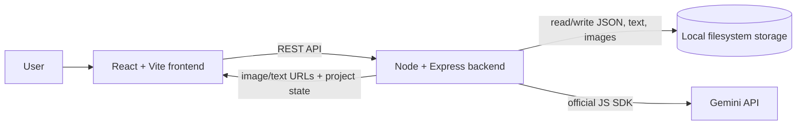
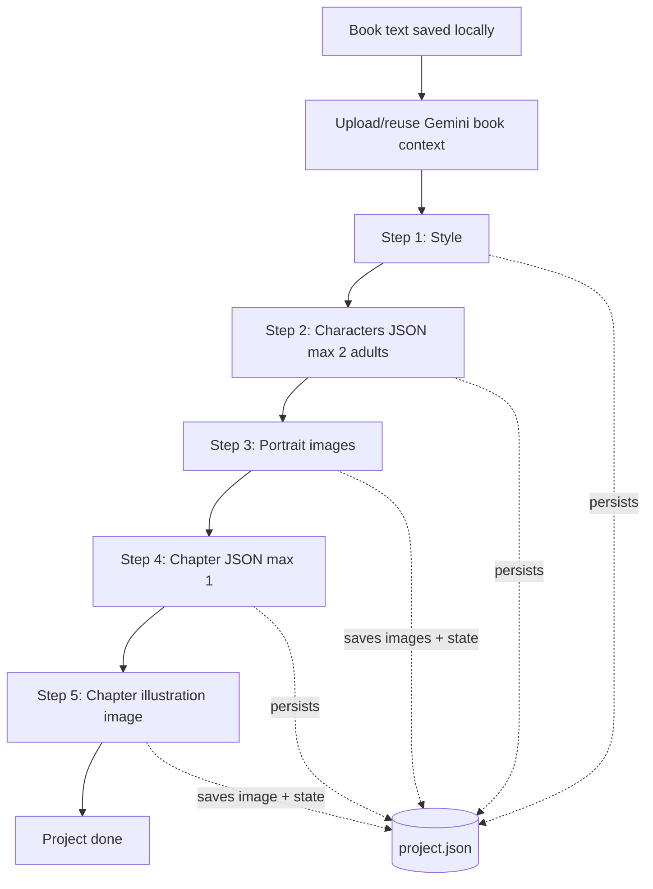
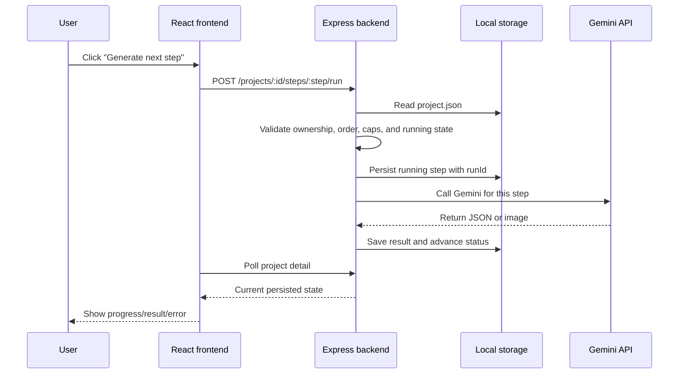

# Architecture

## Big Picture

Book Illustration Studio is a local full-stack app for turning a pasted or uploaded book into a small set of AI-generated illustration assets. A user signs in with name and email, creates a project with book text, then manually runs the five Gemini pipeline steps in order: style, characters, portraits, chapters, and illustrations.

The React app is a thin client. It renders the current project state and sends explicit user actions to the Express API. The backend is the source of truth for project ownership, step order, generated results, retries, and duplicate-call prevention. Local JSON files hold project metadata, while book text and generated images live on the filesystem.



End to end, the flow is:

1. User enters name and email.
2. Backend creates or loads the user.
3. User creates a project with title and book text.
4. Backend saves `book.txt` and creates project metadata.
5. User opens the project detail page and runs one pipeline step at a time.
6. Backend claims the requested step, calls Gemini, saves results, and advances the project.
7. Frontend polls while work is running and re-renders from persisted backend state.

This keeps the app small while still satisfying the important requirements: resumability, no duplicate Gemini calls, server-side caps, retryable failures, and durable generated results.

## Pipeline Flow

The pipeline follows the first five steps of Google's book illustration notebook. Each step is user-triggered. The backend enforces order and never auto-runs the next step.



Gemini context is created once from the book text, then reused through file/context references or interaction chaining. The full book should not be sent again for every step.

## How The Pieces Interact

The frontend does not run pipeline logic directly. It asks the backend for the project, shows the next allowed action, and posts a run or retry request when the user clicks.

The backend handles each run request as a state transition:



Refreshes and second tabs are handled the same way as normal page loads: the frontend reads the current project state from the backend. If a step is already running, the backend returns that running state instead of starting another Gemini call.

## Frontend Responsibilities

- Collect name and email for lightweight identity.
- Show the user's project list with status and five-step progress.
- Create projects from pasted text or a `.txt` upload.
- Show project detail, including full book text, current style, character cards, chapter cards, image progress, errors, and stuck-step recovery.
- Poll project detail while a step is running.
- Disable obvious duplicate clicks in the UI.

The frontend is not trusted to enforce step order, stale-step recovery, or the 2-character / 1-chapter limits.

## Backend Responsibilities

- Create or load users by email.
- Create projects and write book text to local storage.
- Own the pipeline state machine.
- Enforce step order and server-side caps.
- Persist every generated artifact before advancing state.
- Store Gemini file/context IDs so later steps reuse book context.
- Prevent duplicate Gemini calls across double-clicks, refreshes, and multiple tabs.
- Expose generated images through project-scoped routes.

## Project And Pipeline State Model

Use one `project.json` per project. Keep a simple top-level `status` for list views and a more specific `stepState` for the currently running or failed operation.

```json
{
  "id": "project_abc",
  "userEmail": "student@example.com",
  "title": "The Wind in the Willows",
  "createdAt": "2026-08-19T06:00:00.000Z",
  "updatedAt": "2026-08-19T06:10:00.000Z",
  "status": "CREATED",
  "currentStep": "STYLE",
  "stepState": {
    "status": "idle",
    "step": null,
    "runId": null,
    "startedAt": null,
    "error": null
  },
  "gemini": {
    "fileUri": "files/...",
    "bookInteractionId": "..."
  },
  "style": null,
  "characters": [],
  "chapters": []
}
```

Recommended project statuses:

- `CREATED`: book text saved, style not generated yet.
- `STYLE_DONE`
- `CHARACTERS_DONE`
- `PORTRAITS_DONE`
- `CHAPTERS_DONE`
- `DONE`

Recommended step states:

- `idle`: next step can run.
- `running`: a specific step is in progress.
- `failed`: that exact step can be retried.
- `stale`: derived at read time when a running step's `startedAt` is older than that step's conservative timeout.

For image steps, store per-item progress so portraits and illustrations can land one at a time:

```json
{
  "id": "char_1",
  "name": "Mr. Toad",
  "prompt": "...",
  "image": {
    "status": "done",
    "path": "portraits/char_1.png",
    "error": null,
    "geminiInteractionId": "..."
  }
}
```

## Storage Layout

```text
data/
  users.json
  projects/
    project_abc/
      project.json
      book.txt
      images/
        portraits/
          char_1.png
          char_2.png
        chapters/
          chapter_1.png
```

`users.json` maps normalized emails to user records and project IDs. Each project owns its own folder so metadata, source text, and generated images stay isolated.

Writes should be atomic: write JSON to a temporary file in the same directory, then rename it over `project.json`. Combine this with an in-process per-project mutex for overlapping HTTP requests. After a server restart, persisted `stepState` becomes the source of truth.

## REST API Endpoints

Authentication can be a simple signed cookie or local token returned after identity creation.

- `POST /api/session`: create or load a user from `{ name, email }`.
- `DELETE /api/session`: sign out.
- `GET /api/projects`: list the current user's projects.
- `POST /api/projects`: create a project from title plus uploaded `.txt` or pasted `bookText`.
- `GET /api/projects/:projectId`: return full project detail, including derived stale state.
- `GET /api/projects/:projectId/book`: return the stored book text.
- `POST /api/projects/:projectId/steps/:step/run`: run the next allowed step, or return the existing in-flight state.
- `POST /api/projects/:projectId/steps/:step/retry`: retry a failed or stale step.
- `GET /api/projects/:projectId/images/:kind/:fileName`: stream a generated project image.

Polling is enough for the base assessment. SSE or WebSockets would be a bonus, not a requirement.

## Gemini Integration Flow

Use the official `@google/genai` JavaScript SDK behind a small backend wrapper, pinned to an explicit package version. Use `GEMINI_API_KEY` from the environment and keep a `.env.example` with variable names only. SDK-specific code should stay inside the wrapper so the rest of the backend works with app-level methods like `generateStyle`, `generateCharacters`, and `generatePortrait`.

Before the first Gemini step, the backend saves the book locally, uploads it through Gemini's File API, creates a reusable book context or interaction, and persists the returned identifiers.

Step 1, Style:

- Use the user-supplied style if provided, otherwise ask Gemini to generate one from the book context.
- Persist the final style and any interaction ID needed by later steps.

Step 2, Characters:

- Ask for main adult characters only, with a max of 2.
- Request structured JSON with `{ name, prompt }` and an array schema using `maxItems: 2`.
- Parse and validate the response on the server.
- Fail the step if Gemini returns more than 2 characters or an invalid shape.
- Persist the character list.

Step 3, Portraits:

- Generate portraits sequentially for the capped character list.
- Save each image file and update that character's image status as soon as it completes.

Step 4, Chapters:

- Ask for chapter illustration prompts that reference the characters, with a max of 1.
- Request structured JSON with `{ name, prompt }` and an array schema using `maxItems: 1`.
- Parse and validate the response on the server.
- Fail the step if Gemini returns more than 1 chapter or an invalid shape.
- Persist the chapter list.

Step 5, Illustrations:

- Generate the single chapter illustration using the chapter prompt, style, and prior character portrait context.
- Save the image before marking the project done.

## Duplicate Execution And Concurrency Strategy

The backend performs an atomic "claim step" before every Gemini call:

1. Acquire the in-process mutex for the project.
2. Read `project.json`.
3. Verify the user owns the project.
4. Verify the requested step is exactly the next allowed step.
5. If the same step is already running and not stale, return the existing running state.
6. If failed or stale, require explicit retry.
7. Set `stepState` to `running` with `step`, `runId`, and `startedAt`.
8. Atomically write `project.json`.
9. Release the mutex, then call Gemini.

When Gemini finishes, the backend reacquires the project mutex and only commits results if the stored `runId` still matches. This prevents an old request from overwriting a newer retry.

This is enough for a local single-process server. Redis, queues, database transactions, and background workers are intentionally out of scope.

## Failure And Stuck-Step Recovery

If Gemini returns an error, parsing fails, an image is missing, or a file write fails:

- Store `stepState.status = "failed"`.
- Store a user-readable error message and a short technical code.
- Keep completed previous steps intact.
- Keep any current-step images that were already saved.
- Let the user retry only the failed step.

For stuck work after server restart:

- A running step with an old `startedAt` is treated as stale.
- The project detail API returns a stale state with a retry action.
- Retrying creates a new `runId`.
- Old completion handlers must check `runId` before writing final state.

Use conservative per-step stale timeouts, such as 10 minutes for text steps and 20 minutes for image steps. The demo's 8-second timeout is only for fake localStorage timers and is too short for real Gemini calls.

## Assumptions

- The app is reviewed locally by one evaluator at a time, so an in-process mutex plus persisted state is acceptable.
- A server crash cannot continue an HTTP request that died mid-call; the app only needs to detect and recover, not resume the exact network call.
- The Gemini File API object remains valid long enough for the assessment review. If it expires, the retry path can re-upload `book.txt` and refresh `fileUri`.
- Polling project detail during running steps is acceptable.
- Gemini structured output supports enough JSON Schema array constraints for `maxItems` to be part of the request, but the backend still validates the response before saving it.
- Local JSON storage is acceptable if writes are atomic and isolated per project.
